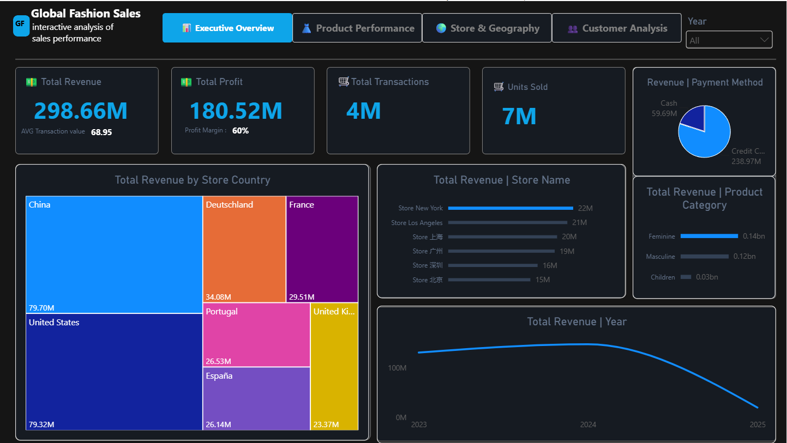

# Global Fashion Sales Dashboard

An interactive **Power BI dashboard** designed to analyze global fashion retail performance across revenue, profit, products, stores, geography, and customers.

The dashboard provides an executive-level overview while allowing users to drill into product performance, store/country performance, and customer behavior.

---

## Dashboard Overview

The dashboard is organized into four analytical pages:

1. **Executive Overview**
2. **Product Performance**
3. **Store & Geography**
4. **Customer Analysis**

A global **Year** filter is available across the dashboard, with additional page-specific filters such as **Product Sub Category** and country/category selectors.

---

## Key Business KPIs

The dashboard currently highlights the following overall metrics:

| KPI | Value |
|---|---:|
| Total Revenue | **298.66M** |
| Total Profit | **180.52M** |
| Profit Margin | **60%** |
| Total Transactions | **4M** |
| Units Sold | **7M** |
| Average Transaction Value | **68.95** |
| Total Customers | **1M** |
| Repeat Customers | **947K** |
| Repeat Customer Rate | **73.83%** |
| Total Stores | **35** |
| Total Countries | **7** |

> KPI values shown above reflect the dashboard state represented in the provided screenshots and can change when filters are applied.

---

# Dashboard Pages

## 1. Executive Overview

The Executive Overview provides a high-level summary of the business and is intended for quick management-level analysis.

### Main KPIs
- Total Revenue
- Total Profit
- Profit Margin
- Total Transactions
- Units Sold

### Main Visuals
- **Total Revenue by Store Country**
- **Total Revenue by Store Name**
- **Total Revenue by Product Category**
- **Total Revenue by Year**
- **Revenue by Payment Method**

### Example insights visible in the dashboard
- China and the United States are among the highest-revenue countries.
- New York is the top-performing store by revenue.
- Credit-card payments account for the majority of revenue.
- Revenue peaks around 2024 before declining in 2025 in the displayed data.

---

## 2. Product Performance

This page focuses on product-level sales and revenue performance.

### Main KPIs
- Units Sold
- Total Profit
- Total Transactions
- Total Revenue
- Average Unit Price

### Main Visuals
- **Products Sub Category | Units Sold**
- **Total Revenue | Product Category**
- **Units Sold and Total Revenue by Product Category**
- **Total Revenue | Product Category Over Time**
- **Product Sub Category** filter

### Product analysis includes
- Pants and Jeans
- Sportswear
- Coats and Blazers
- Accessories
- Shirts
- Dresses and Jumpsuits
- Product categories such as Feminine, Masculine, and Children

This page can be used to identify high-volume product groups, compare category contribution, and analyze how product revenue changes over time.

---

## 3. Store & Geography

This page analyzes the geographic distribution of the retail business and compares store/country performance.

### Main KPIs
- Total Stores: **35**
- Total Countries: **7**
- Total Revenue: **298.66M**
- Top Store: **Store New York**

### Main Visuals
- **Total Revenue | Country** map
- **Total Revenue by Year and Store Name**
- **Total Transactions and Total Revenue by Store Country**
- Country selection tiles

### Countries represented
- China
- United States
- Deutschland / Germany
- France
- Portugal
- España / Spain
- United Kingdom

The geographic page makes it possible to compare revenue concentration between markets and evaluate store performance across different countries.

---

## 4. Customer Analysis

The Customer Analysis page focuses on customer behavior and segmentation.

### Main KPIs
- Total Customers: **1M**
- Total Transactions: **4M**
- Repeat Customer Rate: **73.83%**
- Repeat Customers: **947K**

### Main Visuals
- **Top 10 Customers | Revenue**
- **Customer Country | Revenue**
- **Revenue | Payment Method**
- **Revenue | Gender**
- **Age Group | Total Revenue**

### Customer segmentation
Customers are analyzed using:
- Gender
- Age group
- Country
- Payment method
- Revenue contribution
- Repeat-customer behavior

The dashboard shows a strong repeat-customer base, with approximately **947K repeat customers** and a **73.83% repeat customer rate** in the displayed overall view.

---

# Interactive Features

The dashboard is designed for interactive exploration rather than static reporting.

### Filters & Slicers
- **Year**
- **Product Sub Category**
- Country/category selectors where applicable

### Cross-filtering
Selecting a country, product category, store, age group, or other visual element can filter related visuals on the page, allowing users to investigate specific business segments.

### Drill-down Analysis
Time-based and categorical visuals can be used to compare performance across years, stores, countries, and product categories.

---

# Key Business Questions

This dashboard helps answer questions such as:

### Sales & Finance
- What is the total revenue and profit?
- What is the current profit margin?
- How does revenue change over time?
- Which countries generate the most revenue?

### Products
- Which product subcategories sell the most units?
- Which product categories contribute the most revenue?
- How does product performance change over time?
- What is the average unit price?

### Stores & Geography
- Which store generates the highest revenue?
- Which countries are the strongest markets?
- How are revenue and transactions distributed geographically?
- How does each store perform over time?

### Customers
- How many customers are there?
- What percentage of customers are repeat customers?
- Which customer countries generate the most revenue?
- How does revenue differ by gender and age group?
- Which payment method contributes the most revenue?

---

# Dashboard Structure

```text
Global Fashion Sales
│
├── Executive Overview
│   ├── Revenue
│   ├── Profit
│   ├── Transactions
│   ├── Units Sold
│   ├── Country Performance
│   ├── Store Performance
│   └── Revenue by Year
│
├── Product Performance
│   ├── Units Sold
│   ├── Product Categories
│   ├── Product Subcategories
│   ├── Revenue by Category
│   └── Product Trends
│
├── Store & Geography
│   ├── Store KPIs
│   ├── Country KPIs
│   ├── Geographic Revenue Map
│   ├── Store Trends
│   └── Country Revenue vs Transactions
│
└── Customer Analysis
    ├── Customer KPIs
    ├── Repeat Customers
    ├── Top Customers
    ├── Customer Country
    ├── Gender
    ├── Age Group
    └── Payment Method
```

---

# Tools & Technologies

- **Microsoft Power BI Desktop**
- **Power Query** for data preparation and transformation
- **DAX** for calculated measures and business KPIs
- Interactive Power BI visuals
- Geographic/map visualization
- Data modeling and cross-filtering

---

# Design

The dashboard uses a dark analytical theme with high-contrast blue highlights to keep the interface focused on KPIs and visual comparisons.

The navigation bar provides direct access to the four dashboard pages:

**Executive Overview → Product Performance → Store & Geography → Customer Analysis**

This structure separates strategic, product, geographic, and customer-level analysis while maintaining a consistent user experience.

---

# Project Goals

The main goals of the dashboard are to:

- Provide a centralized view of global fashion sales performance.
- Transform raw retail data into actionable business insights.
- Monitor revenue, profit, transactions, and units sold.
- Identify high-performing products and stores.
- Compare market performance across countries.
- Understand customer demographics and purchasing behavior.
- Analyze customer retention through repeat-customer metrics.
- Support data-driven business and management decisions.

---

# How to Use

1. Open the Power BI report in **Power BI Desktop**.
2. Start from the **Executive Overview** page for a high-level summary.
3. Use the **Year** filter to analyze a specific period.
4. Navigate to **Product Performance** to investigate products and categories.
5. Use **Store & Geography** to compare countries and stores.
6. Open **Customer Analysis** to study customer behavior and segmentation.
7. Click visual elements to cross-filter the other visuals on the page.

---

# Dashboard Preview

Add the exported dashboard screenshots to a repository folder such as:

```text
docs/
└── images/
    ├── executive-overview.png
    ├── product-performance.png
    ├── store-geography.png
    └── customer-analysis.png
```

Then they can be displayed in this README using:

```markdown
## Executive Overview


## Product Performance


## Store & Geography


## Customer Analysis

```

---

# Project Status

**Completed — Interactive Power BI Dashboard**

The dashboard contains four analytical pages covering executive performance, products, stores/geography, and customer behavior.
